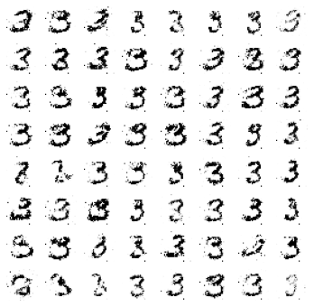

# Conditional - Generative Adversarial Network

 [](https://colab.research.google.com/drive/1dceGNVvcgjvNkB0io3CWV5e9sWpt7U3-?usp=sharing)

### Generator Model

```python
class Generator(nn.Module):
    def __init__(self, latent_size=100):
        super(Generator, self).__init__()
        
        self.label_embedding = nn.Embedding(10, 10)

        self.layer = nn.Sequential(
            nn.Linear(latent_size + 10, 128),
            nn.LeakyReLU(0.2),
            nn.Linear(128, 256),
            nn.BatchNorm1d(256),
            nn.LeakyReLU(0.2),
            nn.Linear(256, 512),
            nn.BatchNorm1d(512),
            nn.LeakyReLU(0.2),
            nn.Linear(512, 1024),
            nn.BatchNorm1d(1024),
            nn.LeakyReLU(0.2),
            nn.Linear(1024, NUM_CHANNELS*IMG_WIDTH*IMG_HEIGHT),
            nn.Tanh()
        )
        
    def forward(self, noise, labels):
        # Concatenate noise and labels
        x = torch.cat((self.label_embedding(labels), noise), -1)
        x = self.layer(x)
        x = x.view(x.size(0), NUM_CHANNELS, IMG_WIDTH, IMG_HEIGHT)
        return x
```

### Discriminator Model

```python
class Discriminator(nn.Module):
    def __init__(self):
        super(Discriminator, self).__init__()
        self.label_embedding = nn.Embedding(10, 10)
        self.layer = nn.Sequential(
            nn.Linear(10 + (NUM_CHANNELS*IMG_WIDTH*IMG_HEIGHT), 512),
            nn.LeakyReLU(0.2),
            nn.Linear(512, 512),
            nn.LeakyReLU(0.2),
            nn.Linear(512, 512), # 1 output for real/fake
            nn.LeakyReLU(0.2),
            nn.Linear(512, 1), # 1 output for real/fake
            nn.Sigmoid(),
        )
    
    def forward(self, img, labels):
        # Concatenate images and labels
        x = torch.cat((img.view(img.size(0), -1), self.label_embedding(labels)), -1)
        x = x.view(x.size(0), -1)
        x = self.layer(x)
        return x
```

### Training loop

```python
def train():

  for epoch in range(101):
      # Iterate over some of the train dateset
      for x, t in train_loader:
          x,t = x.to(DEVICE), t.to(DEVICE)

          z = torch.randn(x.size(0), 100).to(DEVICE)
          gen_labels = torch.randint(0, 10, (64,)).to(DEVICE)

          # Train Generator
          g = G(z, gen_labels).to(DEVICE)
          loss_g = bce_loss(D(g, gen_labels).mean(), torch.ones(1)[0].to(DEVICE)) # fake -> 0, but we're trying to fool D
          optimiser_G.zero_grad()
          loss_g.backward()
          optimiser_G.step()

          # Train Discriminator 
          l_r = bce_loss(D(x, t).mean(), torch.ones(1)[0].to(DEVICE)) # real -> 1
          l_f = bce_loss(D(g.detach(), gen_labels).mean(), torch.zeros(1)[0].to(DEVICE)) #  fake -> 0
          loss_d = (l_r + l_f)/2.0
          optimiser_D.zero_grad()
          loss_d.backward()
          optimiser_D.step()
```

### Results
Results at Epoch 100



Results for Label 3

